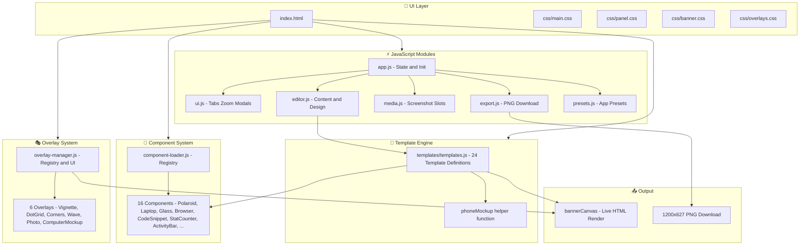
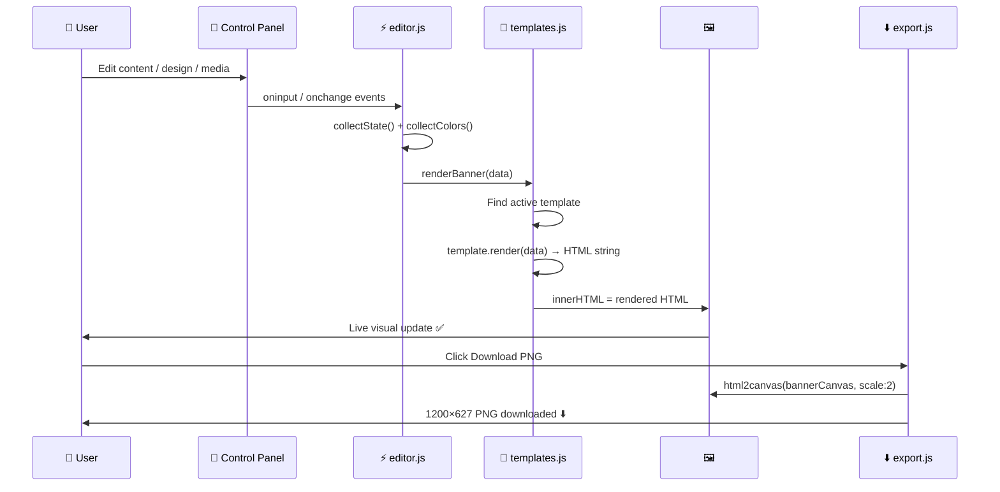
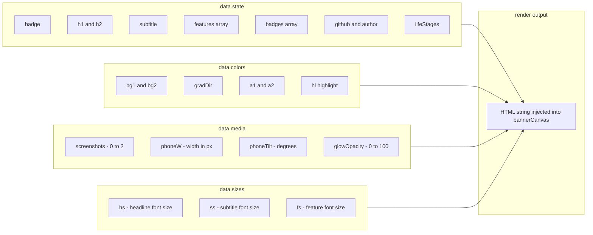
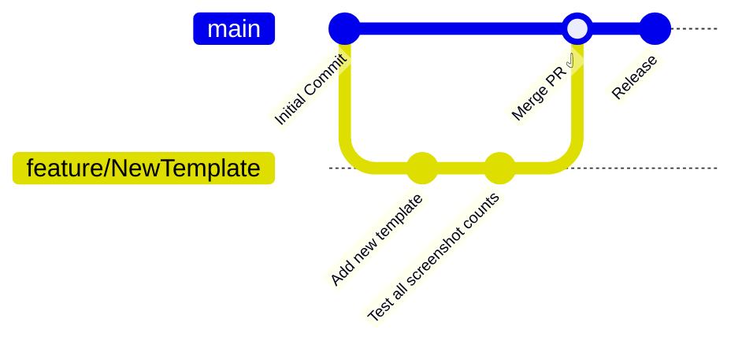

<div align="center">


<br/>

[;⬇️+Export+as+High-Quality+PNG+(1200×627);🎭+6+Design+Overlays+—+Vignette%2C+Waves%2C+Mockups;🧩+16+Reusable+Components+—+Polaroid%2C+Laptop%2C+Glass;⚡+Zero+Dependencies+—+Pure+HTML%2C+CSS+%26+JS;🎯+Quick+App+Swap+Presets+Built+In)](https://git.io/typing-svg)

<br/>

[](https://developer.mozilla.org/en-US/docs/Web/HTML)
[](https://developer.mozilla.org/en-US/docs/Web/CSS)
[](https://developer.mozilla.org/en-US/docs/Web/JavaScript)
[](LICENSE)
[](https://github.com/atanucsejgec/LinkedIn_Banner_Designer/stargazers)
[](https://github.com/atanucsejgec/LinkedIn_Banner_Designer/issues)
[](https://github.com/atanucsejgec/LinkedIn_Banner_Designer/commits)
[](https://atanucsejgec.github.io/LinkedIn_Banner_Designer/)

<br/>

> 🎨 **LinkedIn Banner Designer** is a powerful, browser-based design tool that lets you create stunning, professional LinkedIn post banners — with **28+ unique templates**, **16 reusable components**, **6 design overlays**, **multi-screenshot phone mockups**, **live editing**, and **one-click PNG export** at perfect 1200×627 resolution. No design skills required.

<br/>

[🌐 Live Demo](https://atanucsejgec.github.io/LinkedIn_Banner_Designer/) &bull; [🚀 Getting Started](#️-getting-started) &bull; [✨ Features](#-features) &bull; [📐 Templates](#-templates) &bull; [📁 Structure](#-project-structure) &bull; [🤝 Contribute](#-contributing)

</div>

---

## 📖 Table of Contents

- [📖 Table of Contents](#-table-of-contents)
- [📌 About](#-about)
- [🎯 Why LinkedIn Banner Designer?](#-why-linkedin-banner-designer)
- [📸 Screenshots](#-screenshots)
  - [🖥️ Designer Interface](#️-designer-interface)
  - [📐 Template Gallery](#-template-gallery)
  - [📱 Multi-Screenshot Templates](#-multi-screenshot-templates)
- [✨ Features](#-features)
- [📐 Templates](#-templates)
  - [➕ Adding More Templates](#-adding-more-templates)
  - [🧩 Adding Components](#-adding-components)
  - [🎭 Adding Overlays](#-adding-overlays)
- [🛠️ Tech Stack](#️-tech-stack)
- [🏗️ Architecture](#️-architecture)
  - [📐 Application Flow](#-application-flow)
  - [🔄 Render Pipeline](#-render-pipeline)
  - [🧩 Template Data Contract](#-template-data-contract)
- [⚙️ Getting Started](#️-getting-started)
  - [Prerequisites](#prerequisites)
  - [Quick Start](#quick-start)
  - [🔧 Optional: Local Server](#-optional-local-server)
- [📁 Project Structure](#-project-structure)
- [🗺️ Roadmap](#️-roadmap)
- [🤝 Contributing](#-contributing)
  - [📋 Contribution Guidelines](#-contribution-guidelines)
- [👥 Contributors](#-contributors)
- [📄 License](#-license)
- [📬 Contact](#-contact)
  - [⭐ If this tool helps you create better LinkedIn posts, please give it a star! ⭐](#-if-this-tool-helps-you-create-better-linkedin-posts-please-give-it-a-star-)

---

## 📌 About

**LinkedIn Banner Designer** is a fully client-side web application for designing professional LinkedIn post banners without any design software. It ships with **28+ handcrafted templates**, **16 reusable components**, and **6 composable design overlays**, each template with a unique layout, color scheme, and screenshot arrangement — from classic split layouts to neon glow, GitHub project showcase, magazine cover, orbit rings, and more.

Built with **vanilla HTML, CSS, and JavaScript** and architected into clean, modular files, it's lightweight, fast, and works entirely in your browser. Just open `index.html` and start designing.

---

## 🎯 Why LinkedIn Banner Designer?

<table>
  <tr>
    <td align="center">🔒</td>
    <td><b>100% Private</b></td>
    <td>Everything runs in your browser. Your screenshots and content never leave your device — no uploads, no cloud, no tracking.</td>
  </tr>
  <tr>
    <td align="center">⚡</td>
    <td><b>Zero Setup</b></td>
    <td>No <code>npm install</code>, no build step, no backend required. Open <code>index.html</code> in any modern browser and start designing instantly.</td>
  </tr>
  <tr>
    <td align="center">🎨</td>
    <td><b>28+ Unique Templates</b></td>
    <td>Every template is truly different — unique layout, color scheme, screenshot position, and style. Not just a color swap.</td>
  </tr>
  <tr>
    <td align="center">📱</td>
    <td><b>Multi-Screenshot Support</b></td>
    <td>Some templates support 1, 2, or even 3 phone mockups simultaneously — perfect for showcasing multiple app screens.</td>
  </tr>
  <tr>
    <td align="center">🔄</td>
    <td><b>Quick App Swap</b></td>
    <td>Built-in presets for Age Calculator, Todo App, Weather App, Chat App, and Quiz App. Switch your banner content in one click.</td>
  </tr>
  <tr>
    <td align="center">💾</td>
    <td><b>Save & Reload Designs</b></td>
    <td>Save your current design and reload it any time in the same session. Duplicate designs to iterate quickly.</td>
  </tr>
  <tr>
    <td align="center">📐</td>
    <td><b>Perfect Dimensions</b></td>
    <td>All banners are rendered at exactly 1200×627 px — the optimal LinkedIn post image ratio (1.91:1).</td>
  </tr>
  <tr>
    <td align="center">🧩</td>
    <td><b>Extensible Templates</b></td>
    <td>Templates live in a single file (<code>templates/templates.js</code>). Add more by just pushing new objects into the array.</td>
  </tr>
  <tr>
    <td align="center">🎭</td>
    <td><b>Design Overlays</b></td>
    <td>6 composable overlays (vignette, dot grid, corner accents, wave divider, photo/logo, computer mockup) that layer on top of any template — each with full controls.</td>
  </tr>
  <tr>
    <td align="center">🔧</td>
    <td><b>Reusable Components</b></td>
    <td>16 modular components (polaroid card, laptop frame, glass card, browser window, code snippet card, stat counter row, GitHub activity bar, floating grade, and more) shared across templates.</td>
  </tr>
</table>

---

## 📸 Screenshots

> 💡 A dark-themed, professional designer interface with live canvas preview.

<div align="center">

### 🖥️ Designer Interface

<!-- Replace with actual screenshots after upload -->


<br/><br/>

### 📐 Template Gallery


<br/><br/>

### 📱 Multi-Screenshot Templates


</div>

---

## ✨ Features

<table>
  <tr>
    <td>📐 <b>28+ Unique Templates</b></td>
    <td>Every template has a completely different layout structure, screenshot count, color philosophy, and design language</td>
  </tr>
  <tr>
    <td>📱 <b>Multi-Screenshot Mockups</b></td>
    <td>Templates support 0, 1, 2, or 3 phone screenshots with realistic phone frames, notch, glow effects, and tilt controls</td>
  </tr>
  <tr>
    <td>✍️ <b>Live Content Editing</b></td>
    <td>Edit badge, headline (2 lines), subtitle, description, life stages row, GitHub link, and author handle — all update in real time</td>
  </tr>
  <tr>
    <td>✅ <b>Feature Points Manager</b></td>
    <td>Add, edit, remove, and reorder feature bullet points that appear in the banner dynamically</td>
  </tr>
  <tr>
    <td>🏷️ <b>Tech Badge Manager</b></td>
    <td>Add custom tech badges with your own label and color — full color picker included</td>
  </tr>
  <tr>
    <td>🎨 <b>Full Color Customization</b></td>
    <td>Control background gradient (2 colors + direction), primary accent, secondary accent, and headline highlight color</td>
  </tr>
  <tr>
    <td>🔤 <b>Typography Controls</b></td>
    <td>Adjust headline, subtitle, and feature text sizes individually with range sliders</td>
  </tr>
  <tr>
    <td>📏 <b>Phone Mockup Controls</b></td>
    <td>Control phone tilt angle, phone size, and glow intensity independently per banner</td>
  </tr>
  <tr>
    <td>🔀 <b>Layout Toggles</b></td>
    <td>Toggle top bar, footer, background circles, sparkle effects, and phone frame on/off</td>
  </tr>
  <tr>
    <td>⚡ <b>Quick App Presets</b></td>
    <td>One-click presets for 5 app types: Age Calculator, Todo App, Weather App, Chat App, Quiz App</td>
  </tr>
  <tr>
    <td>💾 <b>Save & Load Designs</b></td>
    <td>Save multiple designs in session memory, reload or delete them from the Templates panel</td>
  </tr>
  <tr>
    <td>📋 <b>Duplicate Design</b></td>
    <td>Instantly duplicate your current design to iterate without losing the original</td>
  </tr>
  <tr>
    <td>↺ <b>Reset to Default</b></td>
    <td>One-click reset that restores all content, colors, and design settings to defaults</td>
  </tr>
  <tr>
    <td>🔍 <b>Zoom & Fit Controls</b></td>
    <td>Zoom the canvas from 15% to 100%, or auto-fit to your screen with one click</td>
  </tr>
  <tr>
    <td>⬇️ <b>PNG Export (1200×627)</b></td>
    <td>High-quality PNG download at 2× resolution using <code>html2canvas</code> — ready to upload to LinkedIn</td>
  </tr>
  <tr>
    <td>👁️ <b>Preview Modal</b></td>
    <td>Full preview of the rendered banner before downloading</td>
  </tr>
  <tr>
    <td>🎭 <b>Design Overlay System</b></td>
    <td>6 composable overlays — vignette, dot grid, corner accents, wave divider, photo/logo, and computer mockup — with individual controls for each</td>
  </tr>
  <tr>
    <td>🧩 <b>Reusable Component System</b></td>
    <td>16 modular components (polaroid card, laptop frame, glass card, browser window, code snippet, stat counter, GitHub activity bar, etc) with a central registry and auto-loading</td>
  </tr>
  <tr>
    <td>⌨️ <b>Keyboard Shortcuts</b></td>
    <td><code>Ctrl+S</code> Save &nbsp; <code>Ctrl+D</code> Download &nbsp; <code>Ctrl++</code> Zoom In &nbsp; <code>Ctrl+-</code> Zoom Out &nbsp; <code>Ctrl+0</code> Fit</td>
  </tr>
</table>

---

## 📐 Templates

All 28 templates have unique layouts, styles, and screenshot arrangements:

<table>
  <thead>
    <tr>
      <th>#</th>
      <th>Template Name</th>
      <th>Screenshots</th>
      <th>Style / Layout</th>
    </tr>
  </thead>
  <tbody>
    <tr>
      <td>01</td>
      <td>🖼️ <b>Classic Split</b></td>
      <td>1 Phone</td>
      <td>Phone left, text right — clean Material 3 style</td>
    </tr>
    <tr>
      <td>02</td>
      <td>🎯 <b>Hero Center</b></td>
      <td>1 Phone</td>
      <td>Large headline left, phone floated right, description included</td>
    </tr>
    <tr>
      <td>03</td>
      <td>📱📱 <b>Dual Screenshot</b></td>
      <td>2 Phones</td>
      <td>Two phones side-by-side with staggered tilt, text left</td>
    </tr>
    <tr>
      <td>04</td>
      <td>📱📱📱 <b>Triple Showcase</b></td>
      <td>3 Phones</td>
      <td>Three cascaded phones at top, text overlay band at bottom</td>
    </tr>
    <tr>
      <td>05</td>
      <td>💻 <b>Terminal Code</b></td>
      <td>1 Phone</td>
      <td>Kotlin-styled code block left, phone right, scanline overlay</td>
    </tr>
    <tr>
      <td>06</td>
      <td>📊 <b>Stats Cards</b></td>
      <td>1 Phone</td>
      <td>Metric stat boxes, features, phone right — data-driven look</td>
    </tr>
    <tr>
      <td>07</td>
      <td>⚡ <b>Feature Grid</b></td>
      <td>1 Phone</td>
      <td>2×2 feature cards grid bottom-left, phone top-right</td>
    </tr>
    <tr>
      <td>08</td>
      <td>⬡ <b>Diagonal Split</b></td>
      <td>1 Phone</td>
      <td>CSS clip-path diagonal background split, dynamic feel</td>
    </tr>
    <tr>
      <td>09</td>
      <td>☀️ <b>Minimal Light</b></td>
      <td>1 Phone</td>
      <td>Light/pastel background, soft shadows — clean professional</td>
    </tr>
    <tr>
      <td>10</td>
      <td>⚡ <b>Neon Glow</b></td>
      <td>1 Phone</td>
      <td>Cyberpunk neon glow, grid overlay, glowing text & borders</td>
    </tr>
    <tr>
      <td>11</td>
      <td>📄 <b>Text Only</b></td>
      <td>No Phone</td>
      <td>Pure text 2-column feature layout — great for concept posts</td>
    </tr>
    <tr>
      <td>12</td>
      <td>📢 <b>Announcement</b></td>
      <td>1 Phone</td>
      <td>Bold mega headline, thick top bar, high-energy launch style</td>
    </tr>
    <tr>
      <td>13</td>
      <td>📐 <b>Neon Wireframe</b></td>
      <td>1 Phone</td>
      <td>Blueprint / wireframe aesthetic with neon grid lines</td>
    </tr>
    <tr>
      <td>14</td>
      <td>💻 <b>Retro Terminal</b></td>
      <td>1 Phone</td>
      <td>CRT terminal window with scanlines, green glow, monospace code</td>
    </tr>
    <tr>
      <td>15</td>
      <td>🪟 <b>Glassmorphism Trio</b></td>
      <td>3 Phones</td>
      <td>Three frosted-glass cards with phones and backdrop blur</td>
    </tr>
    <tr>
      <td>16</td>
      <td>🔷 <b>Isometric Showcase</b></td>
      <td>2 Phones</td>
      <td>Tilted phones in isometric perspective with grid overlay</td>
    </tr>
    <tr>
      <td>17</td>
      <td>📊 <b>Stats Dashboard</b></td>
      <td>No Phone</td>
      <td>Pure stats & metrics showcase with 2×2 stat grid and features</td>
    </tr>
    <tr>
      <td>18</td>
      <td>📸 <b>Polaroid Stack</b></td>
      <td>2 Phones</td>
      <td>Photos scattered like polaroid snapshots, angled with shadows</td>
    </tr>
    <tr>
      <td>19</td>
      <td>🌅 <b>Sunrise Horizon</b></td>
      <td>1 Phone</td>
      <td>Warm radial sunrise gradient behind centered phone</td>
    </tr>
    <tr>
      <td>20</td>
      <td>📰 <b>Magazine Cover</b></td>
      <td>1 Phone</td>
      <td>Editorial / magazine-style layout with serif typography</td>
    </tr>
    <tr>
      <td>21</td>
      <td>🪐 <b>Orbit</b></td>
      <td>1 Phone</td>
      <td>Phone center with orbiting feature rings and stars</td>
    </tr>
    <tr>
      <td>22</td>
      <td>📐 <b>Split Diagonal</b></td>
      <td>1 Phone</td>
      <td>Diagonal split with contrasting accent half and dot pattern</td>
    </tr>
    <tr>
      <td>23</td>
      <td>🃏 <b>Floating Cards</b></td>
      <td>No Phone</td>
      <td>Content displayed as floating glassmorphism cards with subtle rotation</td>
    </tr>
    <tr>
      <td>24</td>
      <td>🐙 <b>GitHub Project Showcase</b></td>
      <td>1 Phone</td>
      <td>GitHub-flavored layout with code snippet card, activity bar, stat counters, and monospace typography</td>
    </tr>
    <tr>
      <td>25</td>
      <td>🔦 <b>Recruiter Spotlight</b></td>
      <td>1 Phone</td>
      <td>Dark, sleek template focused on spotlighting talent or job openings</td>
    </tr>
    <tr>
      <td>26</td>
      <td>🟢 <b>Android Developer</b></td>
      <td>1 Phone</td>
      <td>Square layout (1080×1080) optimized for Instagram/LinkedIn carousels</td>
    </tr>
    <tr>
      <td>27</td>
      <td>🎓 <b>Student Grade Tracker</b></td>
      <td>No Phone</td>
      <td>Square layout utilizing floating grade cards for student highlights</td>
    </tr>
    <tr>
      <td>28</td>
      <td>📐 <b>Shape Calc All In One</b></td>
      <td>1 Phone</td>
      <td>Clean layout demonstrating OOP concepts with specialized shape icons</td>
    </tr>
  </tbody>
</table>

### ➕ Adding More Templates

Templates are fully isolated in `templates/templates.js`. To add a new one:

```javascript
// Push a new object into the TEMPLATES array
TEMPLATES.push({
  id:          'my-template',      // unique kebab-case key
  name:        'My Template',      // display name in UI
  tag:         '1 Screenshot',     // shown under thumbnail
  screenshots: 1,                  // 0 | 1 | 2 | 3
  thumb: {
    bg:    'linear-gradient(135deg, #000, #333)',
    emoji: '🚀',
    label: 'My Style'
  },
  render(d) {
    // d.state     → { badge, h1, h2, subtitle, features[], badges[], ... }
    // d.colors    → { bg1, bg2, gradDir, a1, a2, hl }
    // d.screenshots → [dataUrl|null, dataUrl|null, dataUrl|null]
    // d.phoneW    → phone width in px
    // d.phoneTilt → rotation degrees
    // d.glowOpacity → 0-100
    // d.hs / d.ss / d.fs → headline / subtitle / feature font sizes
    return `<div>...your HTML...</div>`;
  }
});
```

> 💡 Use the shared helper `phoneMockup(src, width, tilt, glow, color)` to render phone mockups consistently across all templates.
> You can also use registered components like `polaroidCard()`, `laptopFrame()`, `glassCard()`, `browserWindow()`, `codeSnippetCard()`, `statCounterRow()`, and `githubActivityBar()` in your templates.

### 🧩 Adding Components

Create a `.js` and `.css` file in `templates/components/`, then register:

```javascript
registerComponent({
  id: 'my-widget',
  name: 'My Widget',
  description: 'A reusable widget for templates',
  cssClass: 'comp-my-widget',
  render: function myWidget(param1, param2) {
    return `<div class="comp-my-widget">...</div>`;
  }
});
```

> 💡 The render function is automatically exposed globally — templates can call `myWidget(...)` directly.

### 🎭 Adding Overlays

Create a `.js` file in `templates/overlays/`, then register:

```javascript
registerOverlay({
  id: 'my-effect',
  name: 'My Effect',
  icon: '✨',
  category: 'style',        // 'style' | 'photo' | 'mockup' | 'decoration'
  controls: [
    { id: 'intensity', type: 'range', label: 'Intensity', min: 0, max: 100, value: 50, suffix: '%' },
    { id: 'color', type: 'color', label: 'Color', value: '#FFD700' }
  ],
  render(colors, state) {
    return `<div style="..."><!-- overlay HTML --></div>`;
  }
});
```

> 💡 Overlays auto-appear in the 🎭 Overlays tab. Supported control types: `range`, `color`, `select`, `file`.

---

## 🛠️ Tech Stack

<div align="center">

[](https://skillicons.dev)

</div>

<br/>

| Category | Technology |
|---|---|
| 🏗️ Structure | HTML5 (Semantic) |
| 🎨 Styling | Vanilla CSS3 (Custom Properties, Grid, Flexbox, clip-path) |
| ⚡ Logic | Vanilla JavaScript (ES6+, no frameworks) |
| 📸 PNG Export | [html2canvas](https://html2canvas.hertzen.com/) v1.4.1 |
| 📐 Canvas Rendering | Pure HTML/CSS injected into `#bannerCanvas` |
| 💾 Session Storage | JavaScript in-memory state object |
| 📦 Dependencies | Zero build tools — single CDN for html2canvas |

---

## 🏗️ Architecture

LinkedIn Banner Designer uses a clean **multi-file modular architecture** with clear separation of concerns. No frameworks, no bundlers — just organized vanilla JavaScript.

### 📐 Application Flow



### 🔄 Render Pipeline



### 🧩 Template Data Contract



---

## ⚙️ Getting Started

### Prerequisites

- ✅ Any modern web browser (Chrome 90+, Firefox 88+, Edge 90+, Safari 14+)
- ✅ That's it. No Node.js, no npm, no installation needed.

### Quick Start

**1. Clone the repository**

```bash
git clone https://github.com/atanucsejgec/LinkedIn_Banner_Designer.git
cd LinkedIn_Banner_Designer
```

**2. Open in browser**

```bash
# Windows
start index.html

# macOS
open index.html

# Linux
xdg-open index.html
```

Or simply **double-click** `index.html` — it works fully offline!

**3. Design your banner**

```
Step 1 → Go to Templates tab → Choose a template
Step 2 → Go to Content tab  → Edit your headline, features, badges
Step 3 → Go to Media tab    → Upload app screenshots
Step 4 → Go to Design tab   → Customize colors and typography
Step 5 → Click ⬇ Download PNG → Get your 1200×627 banner!
```

### 🔧 Optional: Local Server

For best performance with CORS-safe image loading:

```bash
# Python 3
python -m http.server 8080

# Node.js
npx serve .

# PHP
php -S localhost:8080
```

Then open `http://localhost:8080` in your browser.

---

## 📁 Project Structure

```
LinkedIn_Banner_Designer/
│
├── 📄 index.html                    # Main HTML — all panels, tabs, controls
│
├── 📂 css/
│   ├── 🎨 main.css                  # Core layout, nav, buttons, modal, zoom
│   │                                 # • CSS custom properties (dark theme)
│   │                                 # • Main grid layout (panel + canvas)
│   │                                 # • Button variants, notifications
│   │                                 # • Canvas area & status bar
│   │
│   ├── 🎨 panel.css                 # Left panel UI components
│   │                                 # • Tabs, form inputs, toggles, ranges
│   │                                 # • Color pickers, screenshot slots
│   │                                 # • Feature list, badge list
│   │                                 # • Template grid & saved design cards
│   │
│   ├── 🎨 banner.css                # Shared banner canvas styles
│   │                                 # • Phone mockup frame & screen
│   │                                 # • Glow blobs, sparkle animations
│   │                                 # • Tech badges, stat boxes, grid cards
│   │                                 # • Code block, terminal, diagonal clips
│   │
│   └── 🎨 overlays.css              # Overlay panel & layer styles
│                                     # • Overlay card UI (toggle, controls)
│                                     # • Overlay categories & file upload
│                                     # • Preview offset slider bar
│
├── 📂 js/
│   ├── ⚡ app.js                    # Global state (AppState), boot, keyboard
│   │                                 # • AppState: features, badges, screenshots
│   │                                 # • DOMContentLoaded init sequence
│   │                                 # • Ctrl+S/D/+/-/0 shortcuts
│   │                                 # • saveDesign / loadSaved / deleteSaved
│   │                                 # • resetToDefault
│   │
│   ├── ⚡ ui.js                     # UI chrome controls
│   │                                 # • switchTab() — tab navigation
│   │                                 # • zoom() / fitToScreen() / applyZoom()
│   │                                 # • showNotification() with auto-dismiss
│   │                                 # • showPreview() / closeModal()
│   │                                 # • buildTemplateGrid() — renders cards
│   │                                 # • applyTemplate() — switches template
│   │
│   ├── ⚡ editor.js                 # Content & design editing
│   │                                 # • collectState() — reads all form inputs
│   │                                 # • collectColors() — reads color pickers
│   │                                 # • renderBanner() — triggers template render
│   │                                 # • updateBanner() / updateDesign()
│   │                                 # • syncColor() — hex ↔ color picker sync
│   │                                 # • renderFeatureList() / addFeature()
│   │                                 # • renderBadgeList() / addBadge()
│   │                                 # • applyTheme() — 6 preset color themes
│   │
│   ├── ⚡ media.js                  # Screenshot slot management
│   │                                 # • buildScreenshotSlots() — renders 3 slots
│   │                                 # • updateScreenshotSlots(count)
│   │                                 # • handleSlotUpload() — FileReader → dataUrl
│   │                                 # • removeSlot() — clears slot & re-renders
│   │
│   ├── ⚡ export.js                 # PNG export pipeline
│   │                                 # • downloadBanner() — triggers download
│   │                                 # • showPreview() — preview modal
│   │                                 # • generateCanvas() — html2canvas wrapper
│   │                                 # •  scale:2 for 2× resolution output
│   │
│   └── ⚡ presets.js                # Quick app swap presets
│                                     # • APP_PRESETS — 5 app presets defined
│                                     # • buildPresetButtons() — renders buttons
│                                     # • loadPreset(key) — fills all form fields
│
└── 📂 templates/
    │
    ├── 📐 templates.js              # ← ADD MORE TEMPLATES HERE
    │                                 # • TEMPLATES[] array — 28 template objects
    │                                 # • phoneMockup() shared helper function
    │                                 # • shiftHue() color utility
    │                                 # • Each template: id, name, tag,
    │                                 #   screenshots count, thumb, render()
    │
    ├── 📂 components/               # 🧩 Reusable template components
    │   ├── component-loader.js      # Central registry (registerComponent)
    │   ├── polaroid-card.js/.css    # Photo card with white border & shadow
    │   ├── laptop-frame.js/.css     # Laptop device frame mockup
    │   ├── glass-card.js/.css       # Frosted glassmorphism card
    │   ├── browser-window.js/.css   # Browser window with traffic lights
    │   ├── code-snippet-card.js/.css # Syntax-highlighted code block
    │   ├── stat-counter-row.js/.css # Stat counters (stars, forks, etc.)
    │   └── github-activity-bar.js/.css # GitHub commit activity bar chart
    │
    └── 📂 overlays/                 # 🎭 Composable design overlays
        ├── overlay-manager.js       # Central registry & UI builder
        ├── vignette.js              # Dark vignette edge effect
        ├── dot-grid.js              # Dot grid pattern overlay
        ├── corner-accents.js        # Corner brackets / dots / crosses
        ├── wave-divider.js          # Wave / curve / zigzag / slant divider
        ├── photo-frame.js           # Photo / logo overlay with positioning
        └── computer-mockup.js       # Laptop / monitor / browser frame
```

---

## 🗺️ Roadmap

```mermaid
graph LR
    subgraph DONE["✅ Completed"]
        A[24+ Unique Templates]
        B[Multi-Screenshot Support]
        C[Live Content Editing]
        D[Color & Typography Controls]
        E[Phone Mockup with Tilt/Glow]
        F[PNG Export at 1200x627]
        G[Quick App Swap Presets]
        H[Save & Load Designs]
        I[Zoom & Fit Controls]
        J[Keyboard Shortcuts]
        K[Modular File Architecture]
        L[Template Extensibility System]
        M[Component System with 7 Components]
        N[Overlay System with 6 Overlays]
        O[Overlays Tab with Live Controls]
    end

    subgraph PLAN["📋 Planned"]
        P[Custom Font Picker]
        Q[Drag Elements on Canvas]
        R[QR Code Generator]
        S[LinkedIn Auto-Post API]
        T[PWA Offline Support]
    end

    DONE --> PLAN
```



| Status | Feature |
|---|---|
| ✅ Done | 24+ unique templates with different layouts |
| ✅ Done | Multi-screenshot mockups (1 / 2 / 3 phones) |
| ✅ Done | Live banner preview with instant re-render |
| ✅ Done | Full color customization (gradient + accents) |
| ✅ Done | Typography size controls (headline/subtitle/features) |
| ✅ Done | Phone tilt, size, and glow controls |
| ✅ Done | Feature points add / edit / remove |
| ✅ Done | Tech badges with custom colors |
| ✅ Done | Layout element toggles (bar, footer, circles, sparkles) |
| ✅ Done | Quick app swap presets (5 app types) |
| ✅ Done | Save / Load / Delete designs (session) |
| ✅ Done | Duplicate design |
| ✅ Done | Reset to defaults |
| ✅ Done | PNG export at 1200×627 (2× resolution) |
| ✅ Done | Preview modal before download |
| ✅ Done | Zoom controls (15%–100%) + Fit to screen |
| ✅ Done | Keyboard shortcuts (Ctrl+S/D/+/-/0) |
| ✅ Done | Modular file structure (6 JS + 4 CSS + components + overlays) |
| ✅ Done | Extensible template system (add via push) |
| ✅ Done | Reusable component system (7 components with central registry) |
| ✅ Done | Design overlay system (6 composable overlays with per-overlay controls) |
| ✅ Done | Overlays tab in UI (toggle overlays, adjust settings live) |
| ✅ Done | Preview offset slider for vertical positioning |
| 📋 Planned | Custom Google Fonts picker |
| 📋 Planned | Drag-to-reposition elements on canvas |
| 📋 Planned | QR code generator for GitHub/Play Store links |
| 📋 Planned | Export to JPG with quality control |
| 💡 Idea | PWA support for offline use |
| 💡 Idea | LinkedIn direct post integration |
| 💡 Idea | Browser extension for one-click banner generation |

---

## 🤝 Contributing

Contributions are welcome — especially new templates, components, and overlays! 🚀



**1. Fork** the project

**2. Create** your feature branch
```bash
git checkout -b feature/NewTemplate
```

**3. Add your template** to `templates/templates.js`
```javascript
TEMPLATES.push({
  id: 'my-new-template',
  name: 'My New Template',
  tag: '1 Screenshot',
  screenshots: 1,
  thumb: { bg: 'linear-gradient(...)', emoji: '🎨', label: 'New Style' },
  render(d) {
    return `<!-- your HTML here using d.state, d.colors, phoneMockup() -->`;
  }
});
```

**4. Commit** your changes
```bash
git commit -m 'feat: Add MyNewTemplate with diagonal layout'
```

**5. Push** and open a Pull Request 🎉
```bash
git push origin feature/NewTemplate
```

### 📋 Contribution Guidelines

- Keep it **vanilla** — no frameworks, no build tools, no npm packages
- All templates go in **`templates/templates.js`** only
- New **components** → create `.js` + `.css` in `templates/components/`, call `registerComponent()`, add `<link>` and `<script>` in `index.html`
- New **overlays** → create `.js` in `templates/overlays/`, call `registerOverlay()`, add `<script>` in `index.html`
- Test your template with **0, 1, 2, and 3 uploaded screenshots**
- Test across **Chrome, Firefox, and Edge** at minimum
- Use **conventional commits** (`feat:`, `fix:`, `docs:`, `refactor:`)
- Ensure your template renders correctly at **zoom levels 20%–100%**
- Check your template **exports cleanly** as PNG via html2canvas

---

## 👥 Contributors

<div align="center">

[](https://github.com/atanucsejgec/LinkedIn_Banner_Designer/graphs/contributors)

*Made with [contrib.rocks](https://contrib.rocks)*

</div>

---

## 📄 License

Distributed under the **MIT License**. See [`LICENSE`](LICENSE) for more information.

```
MIT License

Copyright (c) 2025 Atanu Biswas

Permission is hereby granted, free of charge, to any person obtaining a copy
of this software and associated documentation files (the "Software"), to deal
in the Software without restriction, including without limitation the rights
to use, copy, modify, merge, publish, distribute, sublicense, and/or sell
copies of the Software, and to permit persons to whom the Software is
furnished to do so, subject to the following conditions:

The above copyright notice and this permission notice shall be included in
all copies or substantial portions of the Software.
```

---

## 📬 Contact

<div align="center">

**Atanu Biswas**

[](https://github.com/atanucsejgec)
[](https://github.com/atanucsejgec/LinkedIn_Banner_Designer)

📌 **Repository:** [https://github.com/atanucsejgec/LinkedIn_Banner_Designer](https://github.com/atanucsejgec/LinkedIn_Banner_Designer)

🌐 **Live Demo:** [https://atanucsejgec.github.io/LinkedIn_Banner_Designer/](https://atanucsejgec.github.io/LinkedIn_Banner_Designer/)

</div>

---

<div align="center">

### ⭐ If this tool helps you create better LinkedIn posts, please give it a star! ⭐

<br/>

> 🎨 **Design Better. Post Smarter. Grow Faster.**


</div>
